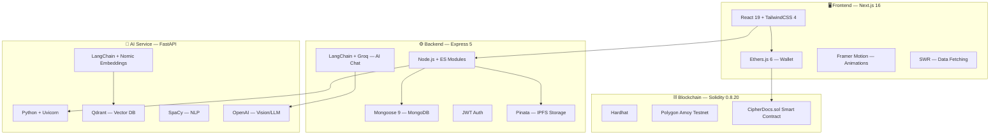

# CipherDocs — Complete Tech Stack Analysis

> Decentralized certificate issuance & verification platform

## Architecture Overview

---

## 1. Frontend

| Technology | Version | Purpose |
|---|---|---|
| **Next.js** | `16.1.6` | React meta-framework (App Router) |
| **React** | `19.2.3` | UI library |
| **React DOM** | `19.2.3` | DOM rendering |
| **TailwindCSS** | `4.x` | Utility-first CSS framework |
| **PostCSS** | — | CSS processing pipeline |
| **Framer Motion** | `12.35.0` | Animations & transitions |
| **Ethers.js** | `6.16.0` | Ethereum wallet interaction (MetaMask) |
| **SWR** | `2.4.0` | Client-side data fetching & caching |
| **React Hook Form** | `7.71.1` | Form state management & validation |
| **React Hot Toast** | `2.6.0` | Toast notifications |
| **React Markdown** | `10.1.0` | Markdown rendering (AI chat) |
| **React Responsive** | `10.0.1` | Responsive breakpoints |
| **Lucide React** | `0.563.0` | Icon library |
| **QRCode** | `1.5.4` | QR code generation |
| **jsQR** | `1.4.0` | QR code scanning/reading |
| **nextjs-toploader** | `3.9.17` | Page transition progress bar |
| **Vercel Analytics** | `1.6.1` | Usage analytics |
| **ESLint** | `9.x` | Linting |

### Frontend Architecture
- **Routing**: Next.js App Router with route groups `(main)`
- **Pages**: Home, Register, Issue Certificate, Issuer Dashboard, User Dashboard, Verify, AI Features, AI Tools
- **State Management**: React Context (`AuthContext`) + SWR caching
- **28 Components** including AI Assistant, Document Extractor, QR Modal, Trust Score Display, Similarity Checker, etc.

---

## 2. Backend

| Technology | Version | Purpose |
|---|---|---|
| **Node.js** | — | Runtime (ES Modules) |
| **Express** | `5.2.1` | Web framework |
| **Mongoose** | `9.1.6` | MongoDB ODM |
| **JSON Web Token** | `9.0.3` | Authentication |
| **Cookie Parser** | `1.4.7` | Cookie handling |
| **CORS** | `2.8.6` | Cross-origin requests |
| **dotenv** | `17.2.4` | Environment variables |
| **Ethers.js** | `6.16.0` | Blockchain interaction (server-side) |
| **Axios** | `1.13.5` | HTTP client (AI service calls) |
| **Multer** | `2.1.1` | File upload handling |
| **LangChain Core** | `1.1.30` | AI orchestration |
| **LangChain Groq** | `1.1.4` | Groq LLM integration |
| **Groq SDK** | `0.37.0` | Groq API client |
| **Mistral AI** | `1.15.1` | Mistral API client |
| **pdf-parse** | `2.4.5` | PDF text extraction |
| **pdf-poppler** | `0.2.3` | PDF to image conversion |
| **Tesseract.js** | `7.0.0` | OCR (image to text) |
| **Form Data** | `4.0.5` | Multipart form data |
| **Nodemon** | `3.1.11` | Dev hot-reload |

### Backend Architecture
- **Pattern**: MVC — Controllers → Services → Models
- **Database**: MongoDB Atlas (cloud-hosted)
- **Models**: `User`, `Certificate`
- **API Routes**: `/api/auth`, `/api/certificates`, `/api/ai`, `/api/ai-enhanced`
- **Services**: IPFS (Pinata), AI Analysis, AI Assistant, AI Service Client
- **Storage**: IPFS via Pinata (encrypted document storage)

---

## 3. AI Service (Python)

| Technology | Version | Purpose |
|---|---|---|
| **FastAPI** | `0.115.0` | Async Python web framework |
| **Uvicorn** | `0.32.0` | ASGI server |
| **Pydantic** | `2.9.2` | Data validation & settings |
| **LangChain** | `0.3.7` | AI orchestration framework |
| **LangChain Community** | `0.3.5` | Community integrations |
| **LangChain Nomic** | `0.1.3` | Nomic embeddings |
| **LangChain Qdrant** | `0.2.0` | Qdrant vector store integration |
| **Nomic** | `≥3.1.3` | Embedding model |
| **OpenAI** | `1.54.4` | LLM & vision model API |
| **Qdrant Client** | `1.12.0` | Vector database client |
| **SpaCy** | `3.8.2` | NLP (text processing) |
| **PyPDF** | `5.1.0` | PDF parsing |
| **pdfplumber** | `0.11.4` | Advanced PDF extraction |
| **python-docx** | `1.1.2` | DOCX file processing |
| **Pillow** | `≥10.4.0` | Image processing |
| **Unstructured** | `≥0.16.20` | Document parsing |
| **python-magic** | `0.4.27` | File type detection |
| **HTTPX** | `0.27.2` | Async HTTP client |
| **NumPy** | `1.26.4` | Numerical computing |
| **Pandas** | `2.2.3` | Data manipulation |
| **Loguru** | `0.7.2` | Logging |
| **python-jose** | `≥3.4.0` | JWT tokens |
| **Passlib** | `1.7.4` | Password hashing |

### AI Service Architecture
- **Services**: Document Service, Embedding Service, Extraction Service, RAG Service, Trust Score Service, Vector Store Service
- **Capabilities**: Document extraction, AI-powered trust scoring, RAG-based Q&A, semantic similarity checking, document content analysis

---

## 4. Blockchain

| Technology | Version | Purpose |
|---|---|---|
| **Solidity** | `0.8.20` | Smart contract language |
| **Hardhat** | `2.22.3` | Development & deployment framework |
| **Hardhat Toolbox** | `5.0.0` | Testing, debugging, deployment utilities |
| **Polygon Amoy** | — | Testnet (L2 chain) |
| **dotenv** | `17.2.4` | Environment variables |

### Smart Contract — `CipherDocs.sol`
- **Functions**: `issueCertificate()`, `revokeCertificate()`, `getCertificate()`
- **Data**: Document hash, IPFS CID, user/issuer addresses, timestamps, expiry, revocation status
- **Events**: `CertificateIssued`, `CertificateRevoked`
- **Deployed to**: Polygon Amoy at `0x9d368207444a8cD987a7EDce935804a9358Aa467`

---

## 5. Infrastructure & External Services

| Service | Purpose |
|---|---|
| **MongoDB Atlas** | Cloud database |
| **Pinata / IPFS** | Decentralized file storage |
| **Qdrant** | Vector database for RAG |
| **Polygon Amoy** | Blockchain testnet |
| **Groq** | Fast LLM inference (chat) |
| **Mistral AI** | Vision model for document analysis |
| **OpenAI** | LLM & embeddings |
| **Nomic** | Text embeddings |
| **Vercel** | Frontend hosting (`cipherdocs.vercel.app`) |
| **MetaMask** | Web3 wallet (user-side) |

---

## Summary

| Layer | Core Technology | Language |
|---|---|---|
| **Frontend** | Next.js 16 + React 19 + TailwindCSS 4 | JavaScript (JSX) |
| **Backend API** | Express 5 + Mongoose 9 | JavaScript (ES Modules) |
| **AI Service** | FastAPI + LangChain + Qdrant | Python |
| **Blockchain** | Solidity + Hardhat + Polygon Amoy | Solidity |
| **Database** | MongoDB Atlas | — |
| **Vector DB** | Qdrant | — |
| **Storage** | IPFS (Pinata) | — |
| **Auth** | JWT + MetaMask wallet signatures | — |
